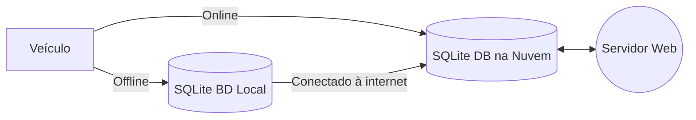

# Rastreamento de Carros Assíncrono *Offline* e Online

## Objetivos

## Como Funciona

```mermaid
flowchart LR
    v["Veículo"] -- Offline --> off_db[("SQLite BD Local")]
    v["Veículo"] -- Online --> on_db[("SQLite BD na Nuvem")]
    off_db[("SQLite BD Local")] -- "Conectado à internet" --> on_db[("SQLite BD na Nuvem")]
    on_db[("SQLite DB na Nuvem")] <--> web_server(("Servidor Web"))
```

## Recursos Utilizados
